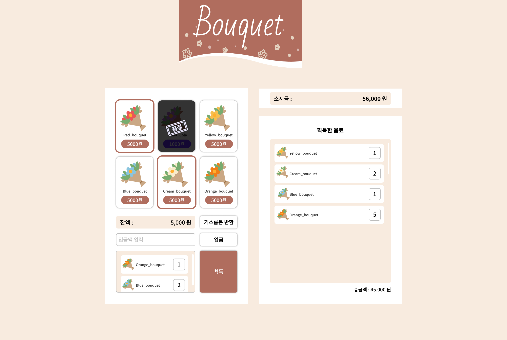

# 꽃다발 자판기 (Bouquet Vending Machine)

 </br>

## 프로젝트 소개 및 개요

```
Vanilla JavaScript로 구현한 자판기에서 꽃다발을 뽑는 웹 어플리케이션입니다.
```

⏰ 작업기간 : 2023.09

🔗 배포링크 : https://zxxng.github.io/BouquetVendingMachine/

🔗 피그마 작업링크 : <a href="https://www.figma.com/file/2235hRriOEVXwIeYYawDF4/bouquetMachine?type=design&node-id=0%3A1&mode=design&t=KJ0QSZACjmR6yy0S-1">Figma Design URL</a>

</br>

## 기술 및 개발 환경

##### Front-end

  

##### Design


##### 배포


## 🔍 주요 기능

- 소지금 입금 기능
- 거스름돈 반환 기능
- 장바구니 채우기 기능
- 장바구니 목록 획득 기능

## ✍️ 학습 내용

- **Class 문법 활용**으로 **객체지향 개념 학습**
- createDocumentFragment()를 활용한 가상 메모리에서의 DOM 조작으로 **웹 페이지 성능 및 효율성 향상**
- JavaScript modules 활용으로 **코드 유지/관리 및 재사용성 강화**
- 웹 접근성을 고려한 **시멘틱 태그** 사용
- PC 및 모바일 사용자 대상 **반응형** 적용

## 📁 폴더 구조

```shell
.
├── README.md
├── assets
│   ├── images
│   │   └── # png files
│   └── items.json
├── index.html
├── js
│   ├── app.js
│   └── classes
│       ├── BouquetGenerator.js
│       └── BouquetMachineEvents.js
└── style.css
```

### 🙏🏼 커밋 컨벤션

| 커밋 유형 | 설명                              |
| --------- | --------------------------------- |
| Feat      | 새로운 기능 구현, 특징 추가       |
| Style     | UI/스타일 수정                    |
| Refactor  | 리팩토링                          |
| Rename    | 파일명, 디렉토리명 변경           |
| Fix       | 버그해결, 수정                    |
| Del       | 어떤 요소 혹은 파일을 삭제했을 때 |
| Docs      | 문서 관련 작업                    |
| Chore     | 자잘한 수정에 대한 커밋           |
